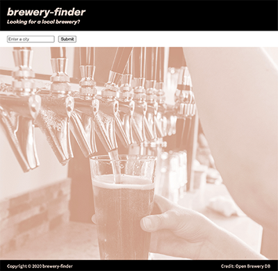
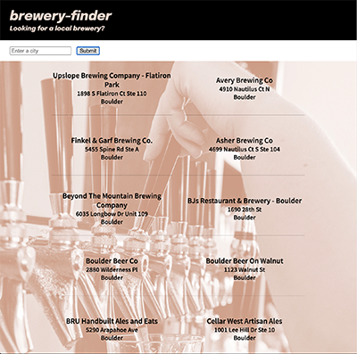

# brewery finder

I thought it'd be fun to have an app that would find local breweries in my city or anywhere in the country. By entering a city name, a list of local breweries will be displayed on the page.

## Screenshots of app:

Main page

After a search

## Technologies Used:

- HTML5 - for page structure
- CSS3 - for page look and responsiveness
- JavaScript - for page interaction with user
- jQuery - for page interaction, especially with using AJAX to send/receive data to the API and update the DOM
- Google Fonts - for using custom fonts

## Getting Started
Link to site:

https://darryltait.github.io/brewery-finder

Enter a city, click button and find a brewery

## Next Steps

- Add another input area to filter for brewpubs, micro-breweries, regional beers
- See if there's an API that would let you see if the place serves food or if there are restaurants nearby
